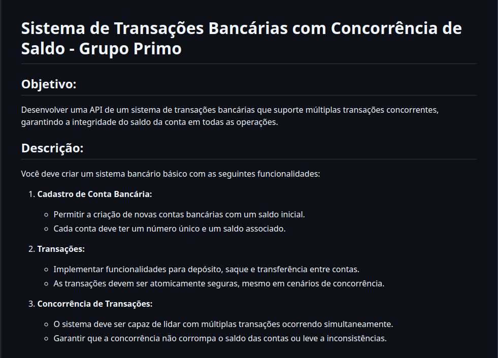

## Sistema de Transações Bancárias com Concorrência de Saldo - Teste para o Grupo Primo

#### Autor

- [Jian Furquim](https://www.linkedin.com/in/jianfurquim/)

## Descrição



### Principais Ferramentas

- Linguagem:

  - Typescript

- Frameworks/Libs:

  - Fastify
  - Prisma
  - Vitest

- Banco de dados:

  - Postgres

- Conteinerização

  - Docker
  - Docker Compose

- Padrões
  - SOLID

### Solução p/ concorrência

Para lidar com a concorrência foi utilizado os mecanismos de LOCK e TRANSACTION do Prisma.

Em cada transação o sistema realiza um LOCK no registro account e todas as transações concorrentes que desejam alterar o mesmo registro aguardam o LOCK.

## Pré requisitos

Para rodar o projeto usa-se Noje.js, Docker e Docker Compose.

## Como rodar

Clonar o repositório

```bash
git clone git@github.com:jianfurquim/teste-backend-grupo-primo.git
```

Acessar a pasta do projeto

```bash
cd teste-backend-grupo-primo
```

Criar .env a partir do arquivo .env.example

```bash
cp .env.example .env
```

Executar o Docker Compose para criar o DataBase

```bash
docker-compose up -d
```

Rodar testes unitários

```bash
npm run test
```

Rodar testes e2e - (Estes contém os cenários de concorrência)

```bash
npm run test:e2e
```

Rodar em ambiente de desenvolvimento

```bash
npm run start:dev
```

Rodar em ambiente de produção

```bash
npm run start
```

## Documentação da Aplicação


- [Documentation](http://localhost:3333/docs)